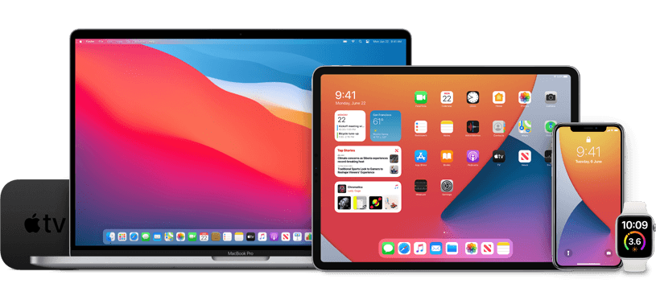

# beta
a repo of beta profiles

## Use Safari to download these:

### ⚠️ These *are* developer betas. For the public beta, go directly to [Apple's website](https://beta.apple.com). 
### Downloading this is a risk. It is *not* meant to go on main devices. If you choose to accept this term, go ahead and choose a download.

##### Sarthak's recommendation: The only stable releases right now are iOS 14, iPadOS 14, and WatchOS 7. DO NOT GET MacOS 11 Big Sur. It is extremely buggy and is prone to make essential apps not work. If you really want it, go ahead and download at your own risk.

<a id="raw-url" href="https://raw.githubusercontent.com/sarthaktexas/beta/master/iOS_14_Beta_Profile.mobileconfig">Download iOS 14 Developer Beta</a> 
<a id="raw-url" href="https://raw.githubusercontent.com/sarthaktexas/beta/master/iOS_iPadOS_14_AppleSeed_Profile.mobileconfig">Download iPadOS 14 Developer Beta</a> 
<a id="raw-url" href="https://raw.githubusercontent.com/sarthaktexas/beta/master/macOSDeveloperBeta16AccessUtility.dmg">Download MacOS 11 Big Sur Developer Beta</a> 
<a id="raw-url" href="https://raw.githubusercontent.com/sarthaktexas/beta/master/watchOS_7_Beta_Profile.mobileconfig">Download WatchOS 7 Developer Beta</a> 

> tvOS 14 is available. Text me at 210-727-3516 for more info.

## Compatible Devices
#### iOS 14
- iPhone 11
- iPhone 11 Pro
- iPhone 11 Pro Max
- iPhone SE (2nd generation)
- iPhone XS
- iPhone XS Max
- iPhone XR
- iPhone X
- iPhone 8
- iPhone 8 Plus
- iPhone 7
- iPhone 7 Plus
- iPhone 6s
- iPhone 6s Plus
- iPhone SE
- iPod touch (7th generation)
#### iPadOS
- iPad Pro 12.9-inch (4th generation)
- iPad Pro 11-inch (2nd generation)
- iPad Pro 12.9-inch (3rd generation)
- iPad Pro 11-inch (1st generation)
- iPad Pro 12.9-inch (2nd generation)
- iPad Pro 12.9-inch (1st generation)
- iPad Pro 10.5-inch
- iPad Pro 9.7-inch
- iPad (7th generation)
- iPad (6th generation)
- iPad (5th generation)
- iPad mini (5th generation)
- iPad mini 4
- iPad Air (3rd generation)
- iPad Air 2
#### MacOS 11 Big Sur
- MacBook (2015 and later)
- MacBook Air (2013 and later)
- MacBook Pro (2013 and later)
- Mac mini (2014 and later)
- iMac (2014 and later)
- iMac Pro (2017 and later)
- Mac Pro (2013 and later)
#### WatchOS 7
- Apple Watch Series 3
- Apple Watch Series 4
- Apple Watch Series 5
